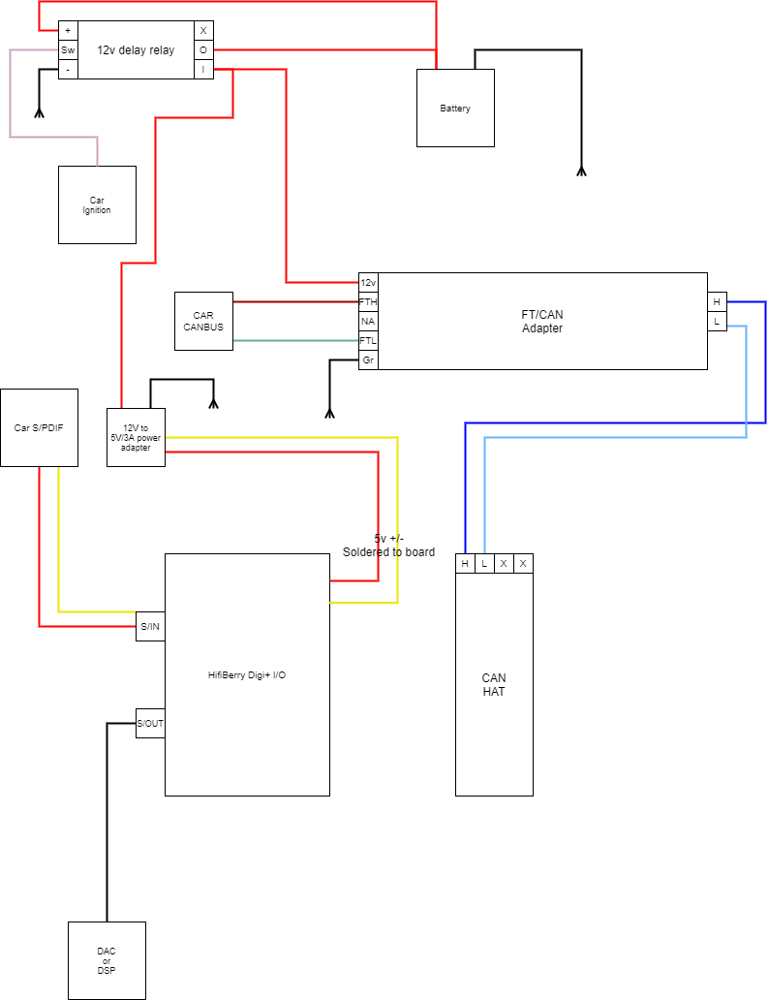

# HyundaiCan
Hyundai CANBus audio control

The primary purpose of this project is to add volume control using a Raspberry Pi, a HiFiBerry Digi+ i/o board, and a CAN hat to a 2015 Hyundai Genesis 5.0 with 14 speaker Lexicon sytem.

The 2015 Hyundai Genesis with the 14 speaker Lexicon audios system uses S/PDIF to transmit audio digitally to the OEM amplifier in the rear trunk of the car, however it is a fixed volume signal. The amplifier in the rear of the car receives signals from the CAN BUS interface to set the volume level, mute, and car on/off status. In order to replace the OEM amplifier with more powerful, better sounding amplifiers the digital signal must be volume controlled prior to being sent to a DSP and/or amplifiers.

## Equipment Needed
The following equipment is needed at minimum to interface with the OEM S/PDIF and CAN BUS interface:

* [Raspberry Pi 4 2GB](https://www.pishop.us/product/raspberry-pi-4-model-b-2gb/?src=raspberrypi)
* [CAN HAT](https://www.amazon.com/RS485-CAN-HAT-Long-Distance-Communication/dp/B07VMB1ZKH)
* [Fault Tolerant CAN converter](https://www.aliexpress.com/item/4000591542373.html)
* [HiFiBerry Digi+ I/O](https://www.hifiberry.com/shop/boards/hifiberry-digi-io/)
* [12V delay relay](https://www.amazon.com/gp/product/B08V5CL4BD/)
* [12V to 5V power supply](https://www.amazon.com/dp/B00CBCGAL8)

## Connection diagram
The following is an example diagram of how to connect the necessary components:

## Raspberry Pi Setup
Raspberry Pi Setup information can be found in the [Installation Guide](INSTALL.md)
